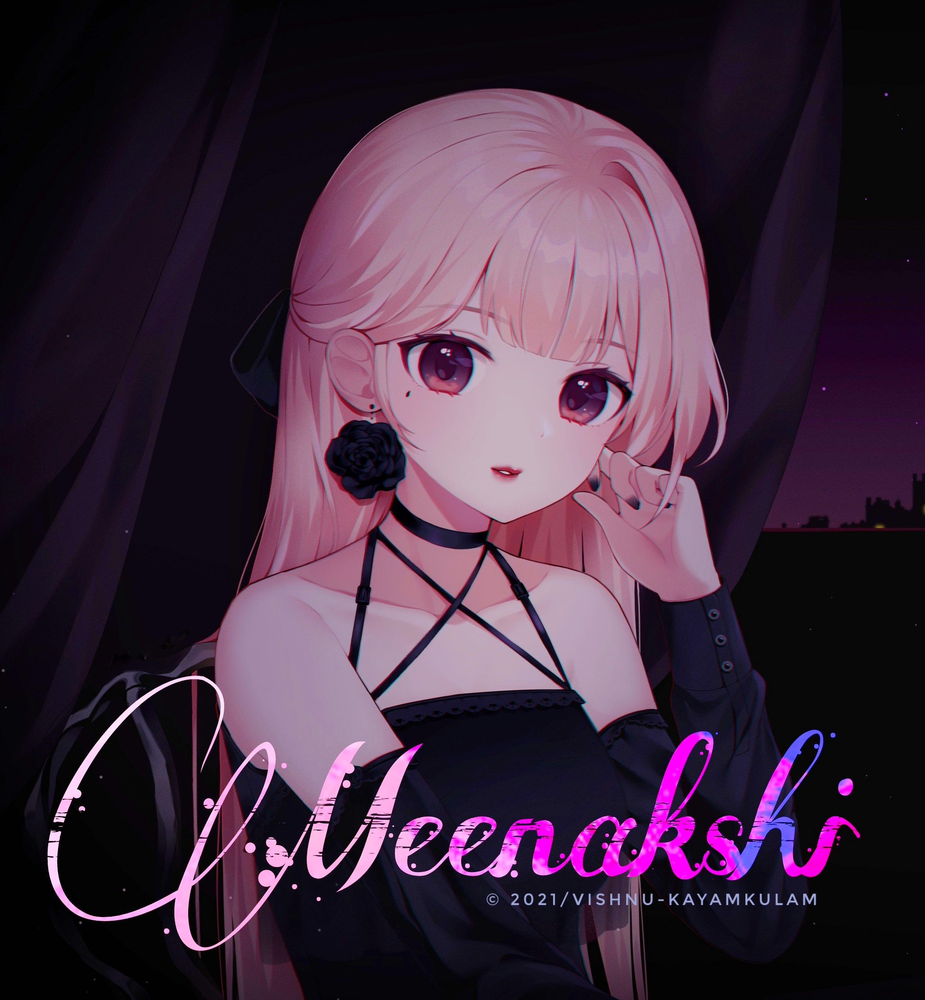

##

<h1 align="center">Hello Dude😁Welcome to my Repo <br>
<p align="center">

## 📢Introduce myself

- 🙂 My name is Vishnu
- 🚩 I'm a beginner in this field
- 📍 I'm from Kayamkulam,Kerala,India🇮🇳
- 🏫 High School at Sree Narayana Central School Kayamkulam
- 🏫 Now I'm studying Diploma in Mechanical Engineering at Carmel Polytechnic College,Punnapra

```
This is a modified version of WhatsAsena🙋🏻‍♀️It will be more useful to you
```

<div align="center">
  
  <p align="center">
<a href="#"></a>
</p>
  <p align="center">
<a href="https://github.com/vishnu-memanakizhakathil"></a>
</p>
</div>
<p align="center">
Project created by <a href="https://github.com/vishnu-memanakizhakathil">vishnu-memanakizhakathil</a> to make it public
    <br>
       | © |
        Reserved |
    <br> 
</p>

----

  <p align="center">
  <a href="httsp://github.com/vishnu-memanakizhakathil/Meenakshi">
    
<p align="center">
<a href="https://github.com/vishnu-memanakizhakathil/followers"></a>
<a href="https://github.com/vishnu-memanakizhakathil/Meenakshi/stargazers/"></a>
<a href="https://github.com/vishnu-memanakizhakathil/Meenakshi/network/members"></a>
<a href="https://github.com/vishnu-memanakizhakathil/Meenakshi/watchers"></a>
<a href="#">
</p>

<h1 align="center"> Connect with me
<p align="center">
  <a href="https://instagram.com/ig.zero.x2k_linda"> 
  <a href="https://wa.me/message/916235989299">
  <a href="https://https://www.facebook.com/danger666host">
  <a href="https://t.me/vishnuprasad62"> <br>
  <a href="https://github.com/vishnu-memanakizhakathil"> 
  
</p>
  

<div align="center">
<p align="center">&nbsp;</p>

<p align="center"></p>
</details> </div>


## 📢 Guide
Click WA logo to Join Support Group 👇
    <br>
<br>
  [](https://chat.whatsapp.com/Cj8KuqHIy1i3TF9yByBMJR)
  <div align="center">
       
  [](https://github.com/vishnu-memanakizhakathil/Meenakshi)
  </div>
    
## Setup
<div align="center">

  ### Simple Method
  
[](https://replit.com/@phaticusthiccy/WhatsAsena-QR)

[](https://heroku.com/deploy?template=https://github.com/vishnu-memanakizhakathil/Meenakshi)
     </div>
<br>
<br >
If Repl.it not working Try Termux for Qr scanning.Just Copy the Link Below in Termux
```
bash <(curl -L https://t.ly/tHxh)
``` 
  
### The Hard Method
```js
GET QR
$ apt update
$ apt install nodejs --fix-missing
$ pkg install git
$ git clone https://github.com/vishnu-memanakizhakathil/Meenakshi
$ cd Meenakshi
$ chmod +x *
$ npm install @adiwajshing/baileys
$ npm install chalk
$ node qr.js
```
      
```js
SETUP
$ git clone https://github.com/vishnu-memanakizhakathil/Meenakshi
$ cd Meenakshi
$ chmod +x *
$ npm i
$ node qr.js
   // scan the qr using whatsapp web on your phone
$ node bot.js
```


### ⚠️ Warning! 
```
Due to Userbot; Your WhatsApp account may be banned.
This is an open source project, you are responsible for everything you do. 
Absolutely, Asena executives do not accept responsibility.
By establishing the Asena, you are deemed to have accepted these responsibilities.
```

### ⚠️മുന്നറിയിപ്പ്!
```
യൂസർബോട്ട് കാരണം; നിങ്ങളുടെ വാട്ട്‌സ്ആപ്പ് അക്കൗണ്ട് നിരോധിച്ചേക്കാം.
ഇതൊരു ഓപ്പൺ സോഴ്‌സ് പ്രോജക്റ്റാണ്, നിങ്ങൾ ചെയ്യുന്ന എല്ലാത്തിനും നിങ്ങൾ ഉത്തരവാദിയാണ്.
തീർച്ചയായും, ഞാനോ അല്ലെങ്കിൽ Asena എക്സിക്യൂട്ടീവുകൾ ഉത്തരവാദിത്തം സ്വീകരിക്കുന്നില്ല.അസേന
സ്ഥാപിക്കുന്നതിലൂടെ, നിങ്ങൾ ഈ ഉത്തരവാദിത്തങ്ങൾ സ്വീകരിച്ചതായി കണക്കാക്കപ്പെടുന്നു.
```

## Developers
  <div align="center">
    
  [](https://github.com/vishnu-memanakizhakathil) |  [](https://github.com/AI-VIKI) | [](https://github.com/afnanplk) 
----|----|----
[vishnu-memanakizhakathil](https://github.com/vishnu-memanakizhakathil)  | [TOXIC4L!3N](https://github.com/AI-VIKI) | [afnanplk](https://github.com/afnanplk)
Author, Base, Bug Fixes, Modules | Modifiying  as   public | Bug Fixes, Modules
  </div>
    


## License
This project is protected by `GNU General Public Licence v3.0` license.

### Disclaimer
`WhatsApp` name, its variations and the logo are registered trademarks of Facebook. We have nothing to do with the registered trademark
